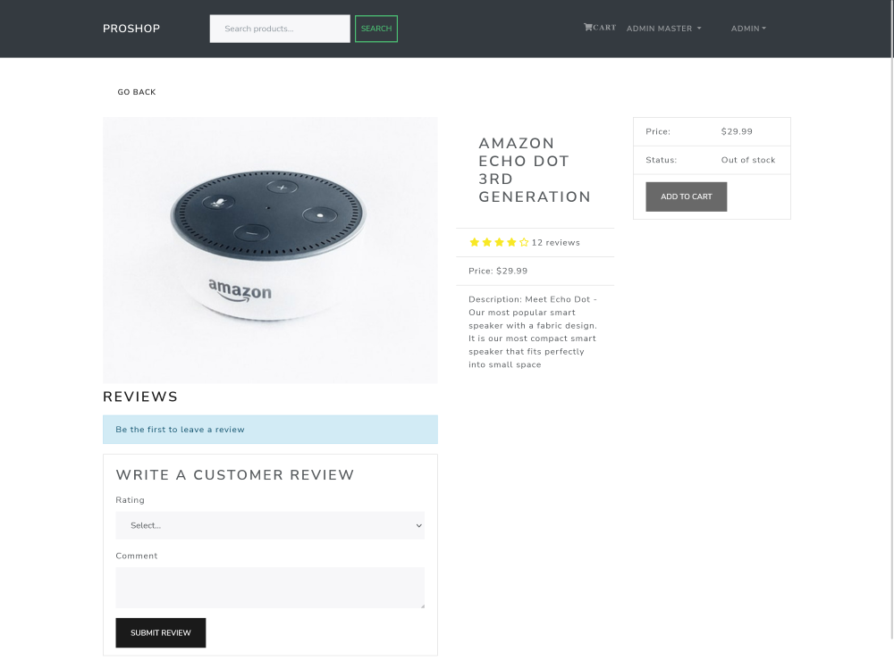

# MERN eCommerce from Scratch Course project

This is a full working project for the Mern eCommerce From Scratch course by Brad Traversy. The project follows the developement of building a full stack eCommerce site with MERN technologies (MongoDb, Express, React, Nodejs)

## Table of contents

- [Overview](#overview)
  - [The challenge](#the-challenge)
  - [Screenshot](#screenshot)
  - [Links](#links)
- [My process](#my-process)
  - [Built with](#built-with)
  - [What I learned](#what-i-learned)
  - [Continued development](#continued-development)
  - [Useful resources](#useful-resources)
- [Author](#author)
- [Acknowledgments](#acknowledgments)

## Overview

### E-Commerce Product site

Users should be able to:
- Create an account and sign-in and store user details in Mongo database.
- Give users ability to edit user profile such as changing their password.
- Add individual items to cart.
- Leave reviews for individual products.
- Remove items from cart.
- View all checkout items and total cost of cart on checkout page
- Place orders and have order history stored in Mongobd. 
- Let signed in users view order history and the status of past orders. (i.e. paid or delivered)
- Check-out using credit card or paypal serverless function (Both types are powered by paypal).
- Sign-in as an admin to go to the admin protected routes. This is accessed by manually going to '/login' route.
- From admin page, be able to update other users to admin status, edit or delete users.
- Ability to add new products to store for admin users.

### Screenshot

### Links

- Full Project Code: [Github-rep](https://github.com/PeshwariNaan/MERN_Project.git)
- Live Site URL: [Live-Link](https://frolicking-pasca-97775f.netlify.app)

## My process

### Built with

- [React](https://reactjs.org/) - JS library
- [React-Bootstrap](https://react-bootstrap.github.io/)
- [MongoDB](https://www.mongodb.com/)
- Express
- Nodejs
- Postman
- Redux (This is using legacy redux)
- CSS Grid
- Flexbox
- SEO optimization

### What I learned

- MERN Full stack application technologies
This was the first full stack application that I have built. I learned how to build the front and backend of a full stack app and how those two sides interact. Gained a great understanding of how to build data models for NoSQL Mongo databases and how to perform CRUD operations by interacting with the client side interface. Learned how to build a Node Express server and how to create different routes on the server side (protected and public) and how to test those routes with Postman during development. This also included working with JWT's for user authorization and authentication. 

### Continued development

I have really enjoyed learning how to build full stack apps and this project has led me to building other full stack apps using what I learned here. It has really expanded my understading of how different technologies interlink and the current state of the internet today. From here I would like to continue building full stack apps and apply new things that I am currently learning such as Typescript and next.js. 

### Useful resources

[Great place to start with Postman](https://learning.postman.com/)

## Author

- Github - [J.D. Browne](https://github.com/PeshwariNaan)
- Frontend Mentor - [@PeshwariNaan](https://www.frontendmentor.io/profile/PeshwariNaan)

## Acknowledgments